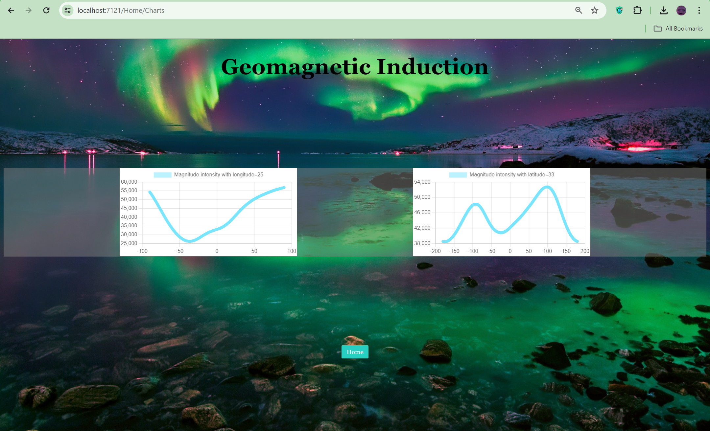
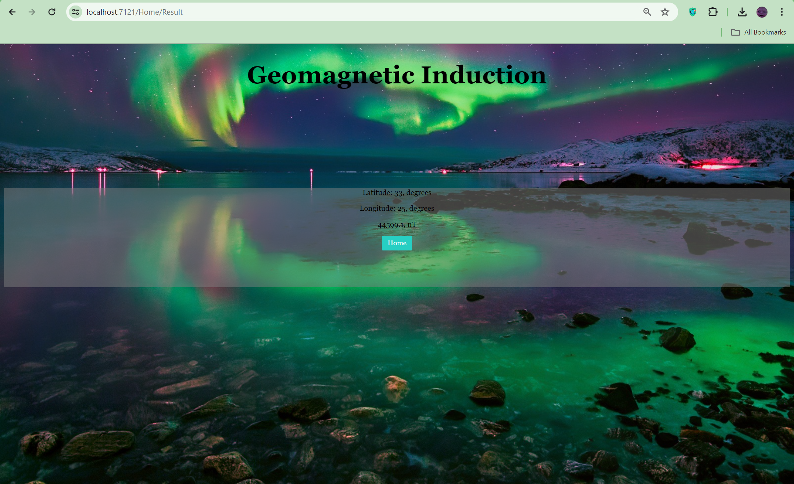
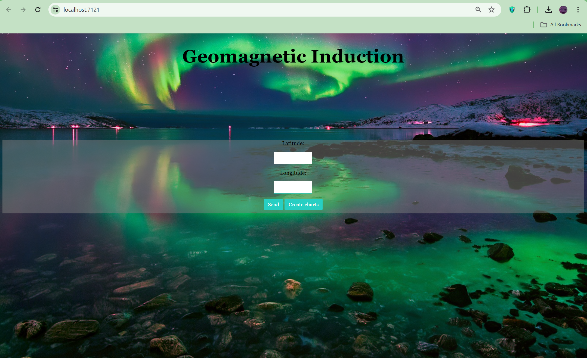

# EarthMagnitudePhysics
Home page, input longitude and latitude for next steps. 
You can find intensity in point or build plots to see how changes latitude(longitude) with set longitude(latitude)

